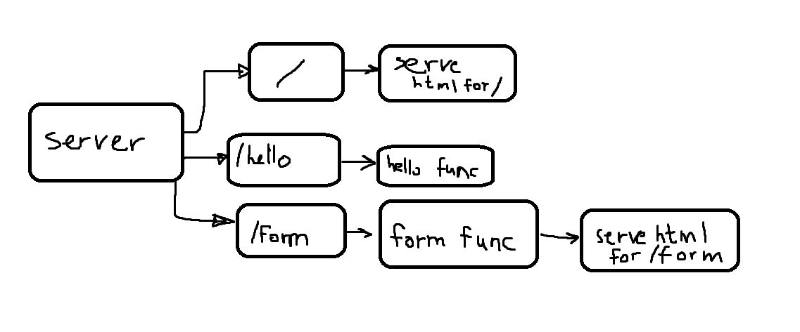

# Go Static Web Server

## Table of Contents

1. [Project Overview](#project-overview)  
2. [Route Overview](#route-overview)  
3. [Architecture Diagram](#architecture-diagram)  
4. [How to Build and Run](#how-to-build-and-run)  

---

## Project Overview

This project features a basic Go server that:

1. **Serves an HTML form** on a GET request.  
2. **Accepts POST requests** from that form (containing `name` and `address`).  
3. **Parses** the form data and displays it back to the user.  

---

## Route Overview

| **Method** | **Route** | **Description**                     |
|------------|-----------|-------------------------------------|
| GET        | `/form.html`   | Serves the HTML form to the user    |
| POST       | `/form`   | Processes form submissions (name + address) |
| GET       | `/`   | Serves the HTML index to the user |
| GET       | `/hello`   | Serves a string response to the user |
---

## Architecture Diagram

Below is a simple placeholder image reference for your project’s flow.

**Explanation of Flow**:
1. **GET** `/form.html` -> form.html is served to user.
    - **User fills out** `name` and `address` fields, clicks **Submit**.
    - **POST** `/form` -> Server reads the form values and responds with a success message, displaying the submitted data.

2. **GET** `/` -> index.html is served to user.
3. **GET** `/hello` -> string is returned to user.

---

## How to Build and Run

1. **Clone the repository**
2. **go build -o server**
3. **./server**
4. **Open your favorite browser at http://localhost:8080**
